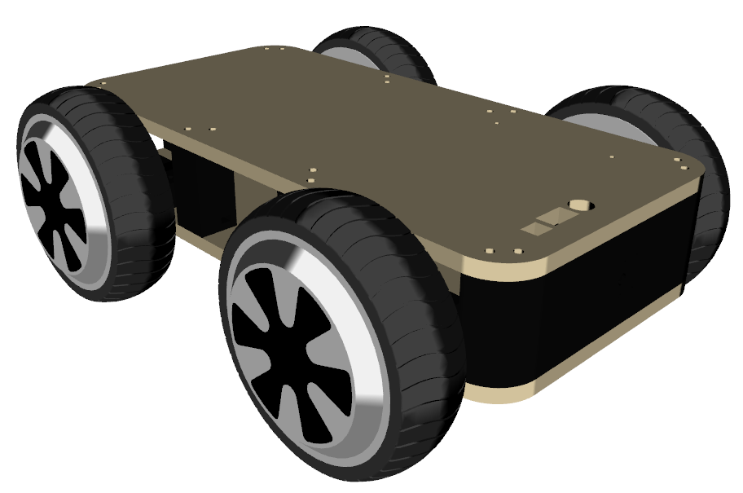

# TugBot
The TugBot mobile robotics development platform was designed around two objectives:
1. Learn how to develop robots in the ROS ecosystem
2. Develop a system to assist in towing small boats up from and down to the waterfront

These two objectives provide the constraints for the design of the system. In particular, the second objective is fleshed out into the following problem specification:
- Distance between house and lake: 500m
- Mass of boats: 50-200kg
- Speed required: walking speed, 0-5 km/h
- Terrain capabilities: Road surfaces, hill between lake and house

# TugBot Design
The TugBot is a four wheel drive skid steer platform. Propulsion is achieved through repurposed HoverBoard wheels controlled by ODrive brushless motor drivers. The HoverBoard wheels provide an integrated motor and wheel assembly with position feedback given by a Hall effect encoder. The wheels are easy to mount by clamping the fixed shaft onto the robot’s chassis. The ODrive motor controllers provides a digital interface to the precise control of brushless motors. A guide for controlling a HoverBoard wheel with an ODrive controller can be found [here](https://github.com/madcowswe/ODrive/blob/master/docs/hoverboard.md).

Unfortunately, the ODrive does not yet have a well supported C++ ROS driver, so a basic driver was developed: [odrive_cpp_ros](https://github.com/BenBurgessLimerick/odrive_cpp_

# TugBot iOS Remote Control App
The TugBot can be controlled from an iOS enabled phone or tablet through the custom built iOS app. This app publishes ROS messages to control the robot. The video stream shown comes directly from a camera mounted at the front of the robot.

# ROS Packages
The skid steer design of the TugBot is similar to the design of Clearpath’s [Husky](https://clearpathrobotics.com/husky-unmanned-ground-vehicle-robot/). The Husky is also developed on the ROS platform and provided the perfect starting point to begin the journey of learning ROS, and deploying it on custom hardware. Most of the ROS packages below are adapted from packages designed for the Husky ([available here](https://github.com/husky/husky)).

## tugbot_base
The tugbot_base package is reponsible for the interface from the ROS system to the ODrive motor drivers. The convention for the control of actuators in a ROS based system is to develop a hardware interface that can be used with the [ros_control](http://wiki.ros.org/ros_control) package.

The four wheels are represented by four joints that can be controlled through a variety of interfaces. For the TugBot, velocity controller of the wheels is desired. This is achieved through the implementation of the velocity joint hardware interface. The interface enables the communication of velocity set points the ODrive axes. The joint state hardware interface is also implemented for the four axes, which is used to communicate the current motor positions and speeds.

Developing the hardware interface under the ros_control architecture makes it easy to utilise existing controllers developed for other robots on the TugBot. The [diff_drive_controller](http://wiki.ros.org/diff_drive_controller). Is an implementation of a controller for differential drive and skid steer robots. By defining the joint velocity and joint state interfaces as well as some basic geometry of the TugBot the controller is adapted to transform a [Twist](http://docs.ros.org/api/geometry_msgs/html/msg/Twist.html) velocity command for the robot into the necessary wheel velocities to achieve the desired motion, and communicate these to the ODrives. The diff_drive_controller also connects to the joint state interfaces and provides an estimated pose and velocity based on the odometry given by the encoders.

Using ros_control also allows for straightforward integration with Gazebo, the robot simulator widely used for ROS projects. 

## tugbot_description
The tugbot_description package contains all the information about the geometry of the TugBot. Critically, tugbot.urdf.xacro containes the the definition of the relationships between the various links in the robot. For example, it defines where the wheels are relative to the chassis of the robot. The file also defines the collision geometry and the inertial properties of the various links, which is used for the simulation. The package also stores all the meshes of the robot model that are used for visual representation in rviz and Gazebo. 

The urdf description can be quickly preview in rviz using a launch file from the urdf_tutorial package. The results of running `roslaunch tugbot_description view_urdf.launch` are shown below.

## tugbot_ekf_localization
The tugbot_ekf_localization package contains the configuration of the [robot_localization](http://wiki.ros.org/robot_localization) used for TugBot. robot_localization implements an extended kalman filter to estimate the pose of a robot by fusing various inputs. For the TugBot, these inputs are the odometry provided by ros_control, and the IMU messages from the onboard IMU. 

## tugbot_gazebo
The tugbot_gazebo package contains the setup for the Gazebo simulation of the TugBot. [Gazebo](http://gazebosim.org/) provides a physics based simulation of robots. The is critical for developing features without access to the robot hardware. The package contains several .world files which contain the definition for several environments used to develop and test TugBot features. In simulation the robot can be controlled exactly as if it was the physical hardware. The same skid-steer controller is running with the only difference being in the definition of the hardware interfaces. This means the simulation can be controlled with the iOS app or through the ros_navigation stack.

## tugbot_slam

The video below demonstrates 2D SLAM using a VLP-16 simulated in Gazebo. TugBot uses Google’s Cartographer SLAM package for ROS. The system was tested in the Gazebo simulation environment. The setup includes a simulation of an IMU which outputs data in the same format as the NAVIO IMU on the physical robot. The simulation also includes a Velodyne VLP-16 to provide point cloud data. In the video below, the robot is driven using the iOS remote control app, and builds up a detailed map of its environment.

